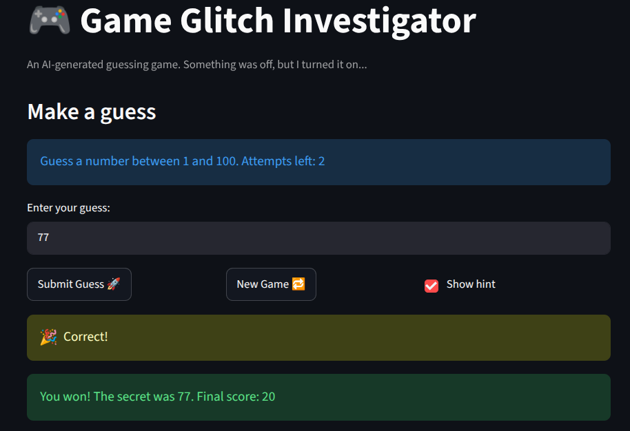

# 🎮 Game Glitch Investigator: The Impossible Guesser

## 🚨 The Situation

You asked an AI to build a simple "Number Guessing Game" using Streamlit.
It wrote the code, ran away, and now the game is unplayable. 

- You can't win.
- The hints lie to you.
- The secret number seems to have commitment issues.

## 🛠️ Setup

1. Install dependencies: `pip install -r requirements.txt`
2. Run the broken app: `python -m streamlit run app.py`

## 🕵️‍♂️ Your Mission

1. **Play the game.** Open the "Developer Debug Info" tab in the app to see the secret number. Try to win.
2. **Find the State Bug.** Why does the secret number change every time you click "Submit"? Ask ChatGPT: *"How do I keep a variable from resetting in Streamlit when I click a button?"*
3. **Fix the Logic.** The hints ("Higher/Lower") are wrong. Fix them.
4. **Refactor & Test.** - Move the logic into `logic_utils.py`.
   - Run `pytest` in your terminal.
   - Keep fixing until all tests pass!

## 📝 Document Your Experience

- [x] Describe the game's purpose.
- [x] Detail which bugs you found.
- [x] Explain what fixes you applied.

## 📸 Demo Walkthrough

Describe your fixed game in numbered steps so a reader can follow along without watching a video:

1. Depending on difficulty, enter a number within a certain range
2. Game returns "Too High" or "Too Low" and you get one less attempt left
3. Enter another guess based on the hint
4. If you're lucky, you win!
5. Start a new game to have more fun! 😀

**Screenshot**: <!-- Insert a screenshot of your fixed, winning game here -->

## 🧪 Test Results

```
====================================================================== test session starts ======================================================================
platform linux -- Python 3.13.3, pytest-9.1.1, pluggy-1.6.0 -- /home/cabrecar007/AIProjects/GameGlitch/.venv/bin/python
cachedir: .pytest_cache
rootdir: /home/cabrecar007/AIProjects/GameGlitch
plugins: anyio-4.14.0
collected 20 items                                                                                                                                              

tests/test_game_logic.py::test_winning_guess PASSED                                                                                                       [  5%]
tests/test_game_logic.py::test_guess_too_high PASSED                                                                                                      [ 10%]
tests/test_game_logic.py::test_guess_too_low PASSED                                                                                                       [ 15%]
tests/test_game_logic.py::test_high_guess_outcome_is_too_high PASSED                                                                                      [ 20%]
tests/test_game_logic.py::test_low_guess_outcome_is_too_low PASSED                                                                                        [ 25%]
tests/test_game_logic.py::test_double_digit_vs_single_digit_compares_numerically PASSED                                                                   [ 30%]
tests/test_game_logic.py::test_int_comparison_is_not_lexicographic PASSED                                                                                 [ 35%]
tests/test_game_logic.py::test_score_does_not_go_negative_on_too_high PASSED                                                                              [ 40%]
tests/test_game_logic.py::test_score_does_not_go_negative_on_too_low PASSED                                                                               [ 45%]
tests/test_game_logic.py::test_too_high_and_too_low_deduct_equally PASSED                                                                                 [ 50%]
tests/test_game_logic.py::test_wrong_guess_deducts_five_when_score_allows PASSED                                                                          [ 55%]
tests/test_game_logic.py::test_win_score_never_goes_below_ten PASSED                                                                                      [ 60%]
tests/test_game_logic.py::test_win_score_rewards_early_guess PASSED                                                                                       [ 65%]
tests/test_game_logic.py::test_empty_string_is_invalid PASSED                                                                                             [ 70%]
tests/test_game_logic.py::test_none_is_invalid PASSED                                                                                                     [ 75%]
tests/test_game_logic.py::test_non_numeric_string_is_invalid PASSED                                                                                       [ 80%]
tests/test_game_logic.py::test_valid_number_parses_correctly PASSED                                                                                       [ 85%]
tests/test_game_logic.py::test_float_string_truncates_to_int PASSED                                                                                       [ 90%]
tests/test_game_logic.py::test_hard_range_is_larger_than_normal PASSED                                                                                    [ 95%]
tests/test_game_logic.py::test_easy_range_is_smaller_than_normal PASSED                                                                                   [100%]

====================================================================== 20 passed in 0.08s =======================================================================
```

## 🚀 Stretch Features

- [ ] [If you choose to complete Challenge 4, describe the Enhanced UI changes here — a screenshot is optional]
